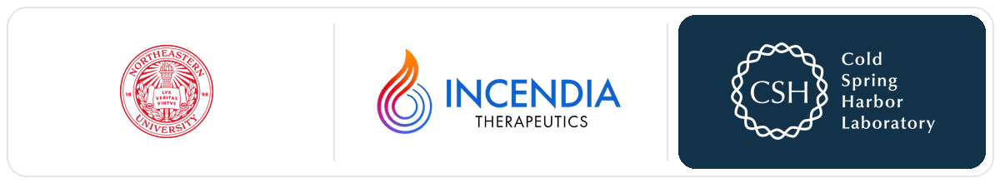

### Bioinformatics software developer building reproducible genomics pipelines, HPC workflows, and interactive analysis apps.

  
  
  
  
  

---

## Featured Repositories

<table>
  <tr>
    <td width="50%">
      <h3><a href="https://github.com/jamesrouse1/CodeSpringLab">CodeSpringLab</a></h3>
      
Reproducible sequencing workflows for RNA-seq, ATAC-seq, ChIP-seq, QC, alignment, counting, differential analysis, enrichment, logs, and reference tracking.

      

        <code>RNA-seq</code>
        <code>ATAC-seq</code>
        <code>ChIP-seq</code>
        <code>SLURM</code>
        <code>R</code>
        <code>Python</code>
      

    </td>
    <td width="50%">
      <h3><a href="https://github.com/jamesrouse1/CodeSpringApp">CodeSpringApp</a></h3>
      
A Shiny-based control center for CodeSpringLab projects with project setup, design matrices, job submission, progress tracking, logs, methods, and embedded results exploration.

      

        <code>Shiny</code>
        <code>HPC</code>
        <code>sbatch</code>
        <code>QC</code>
        <code>DESeq2</code>
        <code>GSEA</code>
      

    </td>
  </tr>
</table>

<table>
  <tr>
    <td width="50%">
      <h3><a href="https://github.com/jamesrouse1/BioinformaticsWorkshops">BioinformaticsWorkshops</a></h3>
      
Teaching materials for Python, R, machine learning, single-cell RNA-seq, experimental design, genomics best practices, and biostatistics.

      

        <code>Teaching</code>
        <code>Workshops</code>
        <code>R</code>
        <code>Python</code>
        <code>scRNA-seq</code>
        <code>Statistics</code>
      

    </td>
    <td width="50%">
      <h3><a href="https://github.com/jamesrouse1/PosterPresentations">PosterPresentations</a></h3>
      
Selected scientific posters and conference presentations spanning translational cancer models, computational biology, and biomarker-focused analyses.

      

        <code>Posters</code>
        <code>Presentations</code>
        <code>Precision medicine</code>
        <code>Cancer biology</code>
      

    </td>
  </tr>
</table>

## About

I work in the **Bioinformatics Shared Resource at Cold Spring Harbor Laboratory**, where I develop computational tools for sequencing analysis, project tracking, visualization, and reproducible research delivery.

My work sits at the intersection of **bioinformatics, scientific software engineering, machine learning, and HPC workflow design**. I build tools that make RNA-seq, ATAC-seq, ChIP-seq, and related genomics analyses easier to run, inspect, reproduce, model, and communicate.

## What I Build

| Area | Focus |
| --- | --- |
| Sequencing pipelines | RNA-seq, ATAC-seq, ChIP-seq, QC, alignment, counting, differential analysis, enrichment workflows |
| Interactive analysis apps | Shiny interfaces for project setup, SLURM submission, logs, progress tracking, QC, plots, and results exploration |
| HPC automation | `sbatch` submission, job recovery, per-sample status tracking, run logs, and project-specific configuration |
| Machine learning | Predictive modeling, feature engineering, supervised learning workflows, and biologically interpretable analysis |
| Reproducible references | GENCODE/STAR/RSEM/Kallisto reference generation, genome version tracking, and methods documentation |
| Scientific visualization | PCA, volcano plots, heatmaps, GSEA outputs, QC summaries, and publication-oriented figures |

## Additional Focus Areas

<table>
  <tr>
    <td width="50%">
      <strong>Single-cell RNA-seq</strong>
       
      QC, integration, clustering, marker discovery, annotation, pathway analysis, and exploratory visualization.
    </td>
    <td width="50%">
      <strong>Whole-genome and variant analysis</strong>
       
      WGS-oriented data handling, genome references, annotation-aware workflows, and reproducible downstream summaries.
    </td>
  </tr>
  <tr>
    <td width="50%">
      <strong>Experimental design and statistics</strong>
       
      Study planning, contrasts, batch effects, covariates, differential testing, multiple-testing correction, and interpretable reporting.
    </td>
    <td width="50%">
      <strong>Teaching and scientific support</strong>
       
      Helping researchers understand computational workflows, troubleshoot analyses, interpret outputs, and build reproducible habits.
    </td>
  </tr>
</table>

## Core Toolkit

  
  
  
  
  
  
  
  
  
  
  

## CodeSpringApp

<table width="100%">
  <tr>
    <td width="50%" align="center">
      
    </td>
    <td width="50%" align="center">
      
    </td>
  </tr>
  <tr>
    <td align="center"><strong>Run Pipeline</strong></td>
    <td align="center"><strong>Progress Tracking</strong></td>
  </tr>
</table>
